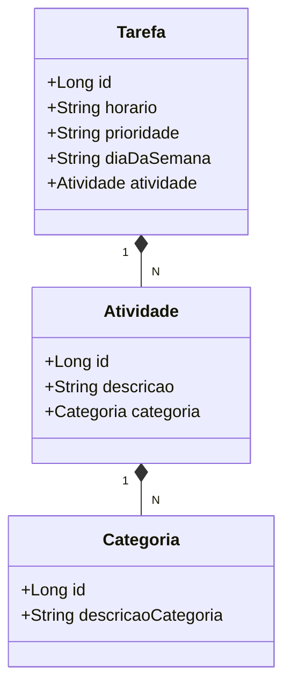

```mermaid
classDiagram
    class Atividade {
        +Long id
        +String descricao
        +Categoria categoria
    }

    class Categoria {
        +Long id
        +String descricaoCategoria
    }

    class Tarefa {
        +Long id
        +String horario
        +String prioridade
        +String diaDaSemana
        +Atividade atividade
    }

    Atividade "1" *-- "N" Categoria
    Tarefa "1" *-- "N" Atividade
```